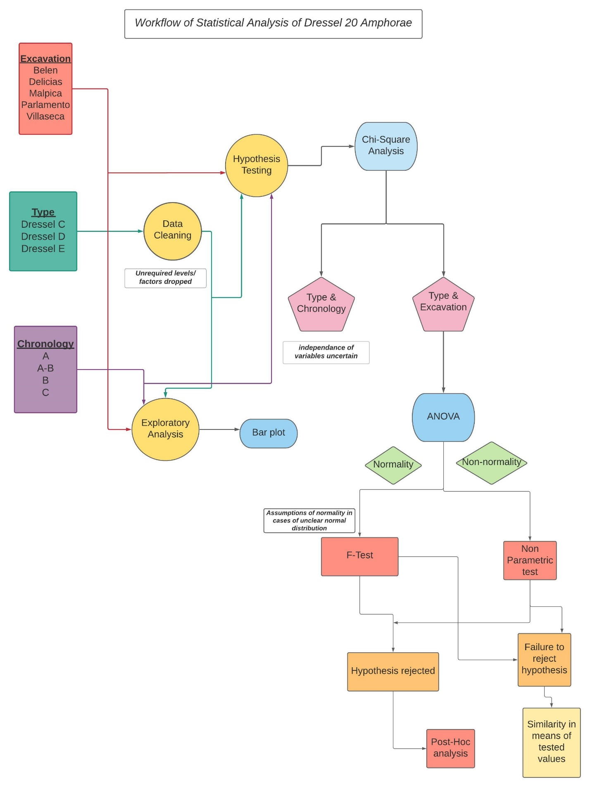

# Statistical Study of Dressel 20 Amphorae Rim Morphometry from Baetica Province (Roman Empire)
Archaeological statistical analysis of Dressel 20 amphorae rim morphometry from the Baetica province of the Roman Empire using R. 

## Overview

This repository contains the statistical analysis of Dressel 20 amphorae rim morphometry from the Baetica province (modern-day Andalusia, Spain) during the Roman Empire. The study was conducted as the final submission for the course "Quantitative Methods in Archaeology" as part of my master's in Digital Archaeology program at Leiden University.

## Abstract

Ceramics are long-lasting archaeological materials, and their study is crucial in reconstructing social and economic trends of archaeological sites. This project analyzes the morphometric dimensions of Dressel 20 amphorae rim sherds to study potential levels of standardization in production methodology. The analysis focuses on Dressel 20 transport amphorae from the Baetica region, which were pivotal in the olive oil trade. Statistical analysis reveals homogeneity in the means of external and internal diameters across different sites, indicating standardized production techniques.

## Introduction

The Baetica region, corresponding to modern-day Andalusia, was a key area for olive oil production and transportation during the Roman Empire. Dressel 20 amphorae, used for olive oil trade, were analyzed for morphometric dimensions to determine the standardization of production techniques. The dataset consists of rim sherds from five sites: Belen, Delicias, Malpica, Parlamento, and Villaseca.

## Data Description

The dataset includes:
- Three categorical variables: type (Dressel C, D, E), excavation sites, and chronology.Workflow of statistical analysisWorkflow of statistical analysis
- Eight quantitative morphometric dimensions of the rims.

## Statistical Analysis

### Workflow

1. **Preliminary Data Cleaning**: Excluded irrelevant amphorae types and cleaned the dataset.
2. **Exploratory Data Analysis**: Visualized counts of amphorae types by chronology and excavation sites.
3. **Hypothesis Testing**:
   - Chi-square tests for associations between categorical variables.
   - ANOVA tests and Kruskal-Wallis tests for similarities in means of exterior and interior diameters across sites.

### Results

- **Chi-Square Analysis**: Statistical associations found between amphorae types and excavation sites, and between amphorae types and chronology.
- **ANOVA and Kruskal-Wallis Tests**: 
  - Dressel C: Similarity in exterior and interior diameters across sites.
  - Dressel D: Similarity in interior diameters; exterior diameters also show similarity after handling outliers.
  - Dressel E: Similarity in interior diameters; exterior diameters showed significant differences.

### Discussion

The analysis suggests homogeneity in production techniques for Dressel C and D amphorae, while Dressel E showed some anomalies in exterior diameters. The study highlights the need for further research, including correlation and regression analysis, to better understand the production standardization.

## Critical Assessment

- Assumptions about chronology and data normality were significant factors in the analysis.
- The dataset lacked proper metadata, making it challenging to interpret some variables without prior knowledge of amphorae typology.
- Additional morphometric dimensions and diagnostic pieces could provide a more comprehensive analysis.

## Full Report

The full report, including detailed analysis, visualizations, and statistical tests, is available in the repository.

## Acknowledgments

This project utilized data from the following source:

- **Original Data Source**: Coto-Sarmiento, M., X. Rubio-Campillo, and J. Remesal. (2018). "Identifying Social Learning between Roman Amphorae Workshops through Morphometric Similarity." Journal of Archaeological Science, 96, 117-23. [https://doi.org/10.1016/j.jas.2018.06.002](https://doi.org/10.1016/j.jas.2018.06.002)
- **GitHub Repository**: The dataset was obtained from the GitHub repository [LearningBaetica](https://github.com/Mcotsar/LearningBaetica).

I would like to thank the authors and contributors of the original project for making the data available for further analysis.

## Repository Contents

- `data/`: Contains the original dataset used for analysis.
- `script/`: R scripts for data cleaning, analysis, and visualization.
- `results/`: Results of the statistical tests and visualizations.
- `report/`: Full report of the project in PDF format.
- `images/`: Images used in the README and report.

## Conclusion

This project demonstrates the application of statistical methods in archaeological research, focusing on the standardization of production techniques for Dressel 20 amphorae. The results provide a foundation for further research into connectivity and knowledge transfer between production sites.

---
